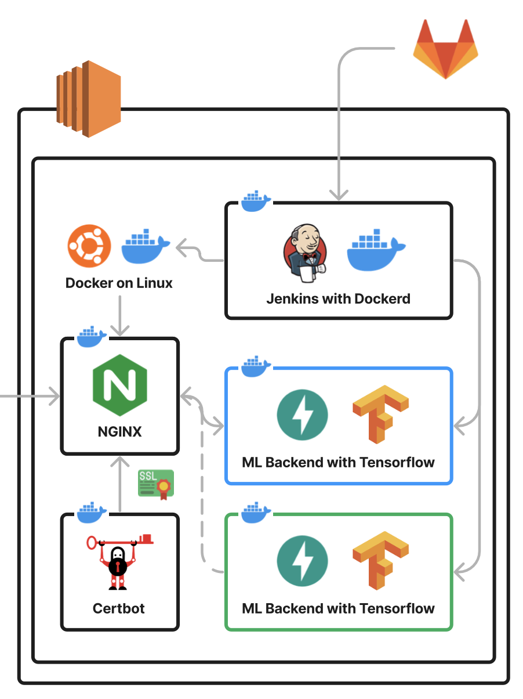

# [ It's Grey ] Fast API Backend Deploy Information

## Deploy Architecture Diagram



## NGINX Configuration

```nginx
# nginx.conf

user nginx;
worker_processes auto;
worker_priority 0;

pid /run/nginx.pid;
include /etc/nginx/modules-enabled/*.conf;

events {
        worker_connections 1024;
        multi_accept off;
}

http {

        ##
        # Basic Settings
        ##

        sendfile on;
        tcp_nopush on;
        tcp_nodelay on;
        keepalive_timeout 65;
        types_hash_max_size 2048;
        server_tokens off;
        
        include /etc/nginx/mime.types;
        default_type application/octet-stream;
        log_format  main  '$remote_addr - $remote_user [$time_local] "$request" '
                          '$status $body_bytes_sent "$http_referer" '
                          '"$http_user_agent" "$http_x_forwarded_for"';

        ##
        # SSL Settings
        ##

        ssl_protocols TLSv1 TLSv1.1 TLSv1.2 TLSv1.3; # Dropping SSLv3, ref: POODLE
        ssl_prefer_server_ciphers on;

        ##
        # Logging Settings
        ##

        access_log /var/log/nginx/access.log main;
        error_log /var/log/nginx/error.log debug;

        ##
        # Gzip Settings
        ##

        gzip on;

        ##
        # Virtual Host Configs
        ##

        include /etc/nginx/sites-available/*;

}

```

```nginx
# /etc/nginx/sites-available/default
# MSA를 위한 Upstream 설정

upstream itsGrey {
        server its-grey-blue:8000;
        keepalive 32;
}

upstream jenkins {
  server jenkins:8080;
  keepalive 32;
}

# HTTP (80 Port 설정)

server {

        listen 80;
        server_name traceoflight.dev;
        server_tokens off;

        # Certbot Location
        location /.well-known/acme-challenge/ {
                allow all;
                root /var/www/certbot;
        }

        location / {
                return 301 https://$host$request_uri;
        }

}

# HTTPS (443 Port 설정)

server {

        listen 443 ssl http2;
        server_name traceoflight.dev;
        server_tokens off;

        # ssl 설정
        ssl_certificate /etc/letsencrypt/live/traceoflight.dev/fullchain.pem;
        ssl_certificate_key /etc/letsencrypt/live/traceoflight.dev/privkey.pem;
        include /etc/letsencrypt/options-ssl-nginx.conf;
        ssl_dhparam /etc/letsencrypt/ssl-dhparams.pem;

        location / {

                # Buffer Size 추가
                proxy_buffer_size           128k;
                proxy_buffers               4 256k;
                proxy_busy_buffers_size     256k;

                # nginx 상태 확인을 위한 Location
                location /status {
                        stub_status;
                }
                
                # itsGrey upstream으로 연결
                location /api/v1/itsGrey {

                        client_max_body_size 30M; # 사진 업로드 용량 30MB로 제한

                        proxy_pass          http://itsGrey;
                        proxy_set_header    Host                $http_host;
                        proxy_set_header    X-Real-IP           $remote_addr;
                        proxy_set_header    X-Forwarded-For     $proxy_add_x_forwarded_for;

                }

        }

}

```


## Docker Compose Settings

```yaml
version: '3.8'

# 네트워크 설정

networks:

  micro_service:
    driver: bridge

# 서비스 설정

services:

  # Jenkins Container 설정
  jenkins:
    container_name: jenkins
    image: jenkins/jenkins:lts
    restart: unless-stopped
    ports:
      - "8181:8080"
    volumes:
      - /home/opendocs/jenkins:/var/jenkins_home
      - /var/run/docker.sock:/var/run/docker.sock
    user: root
    privileged: true
    environment:
      - TZ=Asia/Seoul

  # Nginx Container 설정
  nginx:
    container_name: nginx
    image: nginx
    restart: unless-stopped
    ports:
      - "80:80"
      - "443:443"
    volumes:
      - ./nginx.conf:/etc/nginx/nginx.conf
      - ./sites-available:/etc/nginx/sites-available
      - /home/opendocs/jenkins/service_url.inc:/etc/nginx/service_url.inc
      - ./data/certbot/conf:/etc/letsencrypt
      - ./data/certbot/www:/var/www/certbot
    environment:
      - TZ=Asia/Seoul
    command: "/bin/sh -c 'while :; do sleep 6h & wait $${!}; nginx -s reload; done & nginx -g \"daemon off;\"'"

  # SSL 인증서의 발급을 위한 Certbot 설정
  certbot:
    container_name: certbot
    image: certbot/certbot
    restart: unless-stopped
    volumes:
      - ./data/certbot/conf:/etc/letsencrypt
      - ./data/certbot/www:/var/www/certbot
    entrypoint: "/bin/sh -c 'trap exit TERM; while :; do certbot renew; sleep 12h & wait $${!}; done;'"

```


## Jenkins Shell Command

```sh
#!/bin/bash -ex

# 현재 어떤 컨테이너가 가동 중인지 확인
container_name="its-grey"
if [ $(docker ps -aqf "name=$container_name-blue") ]; then
  last_container="$container_name-blue"
elif [ $(docker ps -aqf "name=$container_name-green") ]; then
  last_container="$container_name-green"
else
  last_container="None"
fi

# 가동 중인 컨테이너 정보에 따른 새로운 컨테이너 결정
if [ "$last_container" == "its-grey-blue" ]; then
  new_container="its-grey-green"
else
  new_container="its-grey-blue"
fi

# 새로운 컨테이너 빌드
docker build -t ${new_container} .
docker run -itd --network micro_service --name ${new_container} ${new_container}
sleep 15

# API 제어를 통한 포트 스위칭
if [ "$new_container" == "its-grey-blue" ]; then
  docker --tlsverify --tlscacert=/.docker/ca.pem --tlscert=/.docker/cert.pem --tlskey=/.docker/key.pem -H=146.56.113.80:2376 exec nginx sed -i '4s/.*$/        server its-grey-blue:8000;/' /etc/nginx/sites-available/default
elif [ "$new_container" == "its-grey-green" ]; then
  docker --tlsverify --tlscacert=/.docker/ca.pem --tlscert=/.docker/cert.pem --tlskey=/.docker/key.pem -H=146.56.113.80:2376 exec nginx sed -i '4s/.*$/        server its-grey-green:8000;/' /etc/nginx/sites-available/default
fi

# nginx reload
docker --tlsverify --tlscacert=/.docker/ca.pem --tlscert=/.docker/cert.pem --tlskey=/.docker/key.pem -H=146.56.113.80:2376 exec nginx nginx -s reload

# 기존 컨테이너 제거
if [ "$last_container" != "None" ]; then
  docker stop $last_container
  docker rm $last_container
fi
```

