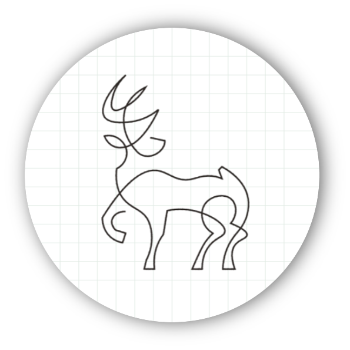

<p align="center"></p>
<h1 align="center">It's Grey</h1>
<hr />
<h3 align="center">
	머신 러닝 기반의 스케치를 제공하는 드로잉 애플리케이션
</h3>
<div align="center">
	<sub>"원하는 사진으로 나만의 책을 엮어보세요"</sub>
</div>

<h3 align="center">
  <a href="https://play.google.com/store/apps/details?id=com.tntt.itsgrey">
    
	에서 다운로드
  </a>
</h3>

## 프로젝트 소개

Lorem ipsum dolor sit amet, consectetur adipiscing elit. Aenean maximus semper accumsan. Fusce vestibulum laoreet ultrices. Nullam vel auctor lacus. Nullam rhoncus, nulla quis dictum tempor, lorem nisi commodo magna, eget condimentum sapien sapien eget sapien. Phasellus eu bibendum nunc. Proin non tincidunt neque. Donec ex orci, ornare consequat lectus vel, accumsan vulputate sapien. Sed quis leo erat. Etiam id scelerisque odio. Ut a imperdiet odio. Nam sit amet risus in dui tempus tincidunt. Ut ac ligula sit amet ante hendrerit mattis in non diam. Vivamus risus elit, rutrum eget volutpat id, tempor ut nisl. Cras pharetra massa eu sapien imperdiet tincidunt eget sit amet velit.


## 진행 기간

2023년 2월 20일 (월) ~ 2023년 4월 7일 (금) **[총 7주 진행]**


## 개발자 소개

|      고은빈      |         김희준         |       안송빈       |       이윤석       |       이창준       |       이치헌       |
| :------------------------------------------------------------------------------: | :---------------------------------------------------------------------------------------------------------------------------------------------------: | :---------------------------------------------------------------------------------------------------------------------------------------------------------------------------------------------------: | :---------------------------------------------------------------------------------------------------------------------------------------------------------------------------------------------------: | :---------------------------------------------------------------------------------------------------------------------------------------------------------------------------------------------------: | :---------------------------------------------------------------------------------------------------------------------------------------------------------------------------------------------------: |
|  |     |    |  |  |  |
|   [@Kongbee](https://github.com/kongbee)   |  [@TraceofLight](https://github.com/ChaeyeonSeo)  | [@fjdks](https://github.com/fjdks) | [@dudnbubn](https://github.com/dudnbubn) | [@Phangg](https://github.com/phangg) | [@Cheetozzeong](https://avatars.githubusercontent.com/u/81691407?v=4) |


## 프로젝트 구조도


## 사용 기술 스택

### Environment

<div>
	
    
    
    
    
    
</div>


### Development

<div>
	
    
    
    
    
    
    
    
</div>


### Communication

<div>
    
    
    
	
</div>


## 주요 기능

### :round_pushpin: 모바일, 타블렛 환경 동시 지원

### :round_pushpin: 사용자의 사진을 기반으로 스케치 파일을 제공

### :round_pushpin: 사용자가 기록을 담을 수 있는 페이지를 제작

### :round_pushpin: 페이지를 엮어 하나의 책으로 만들 수 있으며 뷰어 기능을 제공


## 화면 구성

| 메인 페이지  |  소개 페이지   |
| :-------------------------------------------: | :------------: |
|  |  |
| 강좌 소개 페이지   |  강의 영상 페이지   |
|  |  |

## 프로젝트 파일 구조

### Application

```text
Root
├─app
├─buildSrc
├─core
│   ├─common
│   ├─designsystem
│   │   ├─component
│   │   ├─dialog
│   │   ├─icon
│   │   └─theme
│   ├─network
│   │   ├─retrofit
│   │   └─Firestore
│   ├─ui
│   └─Page 
├─data
│   ├─book
│   ├─drawing
│   ├─imagebox
│   ├─layer
│   ├─page
│   ├─textbox
│   └─user
├─di
├─domain
│   ├─editbook
│   ├─editpage
│   ├─home
│   ├─login
│   ├─model
│   ├─repo
│   └─viewer
└─feature
    ├─drawing
    ├─editBook
    ├─editPage
    ├─home
    └─viewer
```

### Backend

```text
Root
├─api
│   └─v1
│      └─endpoints
│         ├─make_Image.py
│         └─test.py
├─core
│   └─tf_model
│      │   saved_model.pb
│      │   tfhub_module.pb
│      ├─assets
│      └─variables
└─static
    └─images
```
