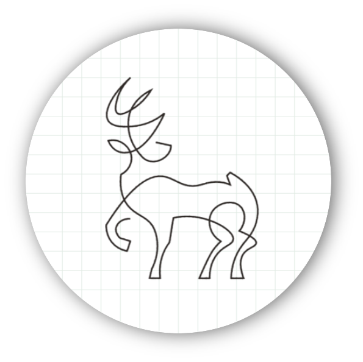
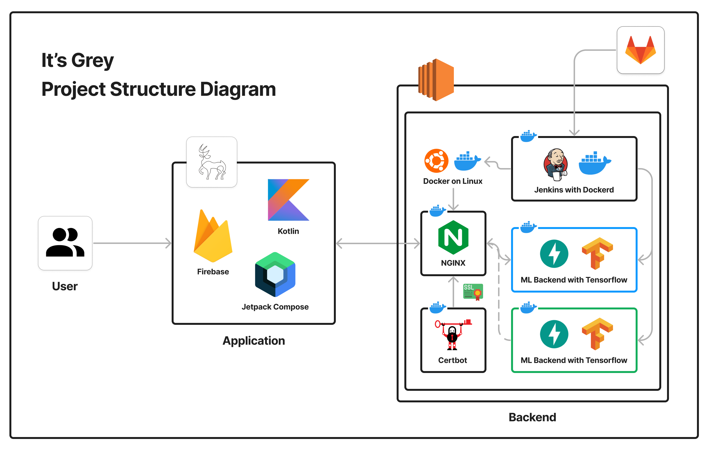
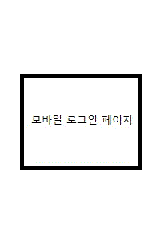
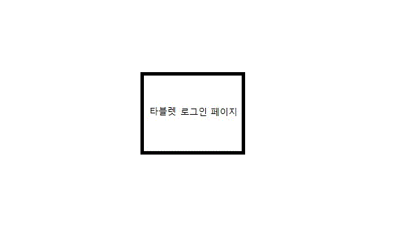
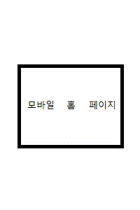
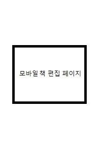
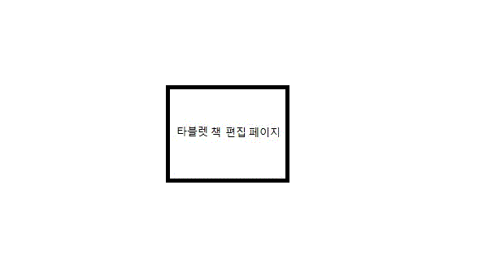

<div align="center">
	
	<h1 align="center">
		It's Grey
	</h1>
</div>
<div align="center">
	<strong>
		머신 러닝 기반의 스케치를 제공하는 드로잉 애플리케이션
	</strong>
    <br />
	<sub>"원하는 사진으로 나만의 책을 엮어보세요"</sub>
</div>
<br />


<div align="center">
	<h3 align="center">
		<a href="https://play.google.com/store/apps/details?id=com.tntt.itsgrey">
			
	에서 다운로드
		</a>
    </h3>
</div>
<br />

## :boom: 프로젝트 소개

그림을 그려보고 싶었는데 배우는 것이 어려워 포기한 적이 있으신가요? 혹은 추억으로 간직하고 싶은 사진을 특별한 방법으로 꾸며보고 싶었던 적이 있으신가요? 

It's Grey는 그림 그리기, 특히 스케칭의 높은 진입 장벽에 어려워하는 사람들을 위해 만들어진 드로잉 애플리케이션입니다. 

그림 그리는 것에 막연한 두려움을 가지고 있던 사람, 조금 특별한 방식으로 추억을 보관하고자 하는 사람, 선 따기를 빨리 & 가볍게 진행하고자 하는 디자이너들까지 It's Grey를 통해 손쉽게 그림을 그릴 수 있습니다!

<br />

## :calendar: 진행 기간

2023년 2월 20일 (월) ~ 2023년 4월 7일 (금) **[총 7주 진행]**

<br />

## :runner: 개발자 소개

|      고은빈      |         김희준         |       안송빈       |       이윤석       |       이창준       |       이치헌       |
| :------------------------------------------------------------------------------: | :---------------------------------------------------------------------------------------------------------------------------------------------------: | :---------------------------------------------------------------------------------------------------------------------------------------------------------------------------------------------------: | :---------------------------------------------------------------------------------------------------------------------------------------------------------------------------------------------------: | :---------------------------------------------------------------------------------------------------------------------------------------------------------------------------------------------------: | :---------------------------------------------------------------------------------------------------------------------------------------------------------------------------------------------------: |
|  |     |    |  |  |  |
|   [@Kongbee](https://github.com/kongbee)   |  [@TraceofLight](https://github.com/ChaeyeonSeo)  | [@fjdks](https://github.com/fjdks) | [@dudnbubn](https://github.com/dudnbubn) | [@Phangg](https://github.com/phangg) | [@Cheetozzeong](https://avatars.githubusercontent.com/u/81691407?v=4) |
| Application |                      CI/CD, ML Backend                       | ML Backend | Application Backend | Application | Application |
| EditPage, Drawing | FastAPI Structure | FastAPI Logic | API, Firestore DB | EditBook, Viewer | Main, Firebase Login |

<br />

## :books: 사용 기술 스택

### :earth_africa: Environment

<div>
	
    
    
    
    
    
</div>
<br />

### :pick: Development

<div>
	
    
    
    
    
    
    
    
</div>
<br />

### :mega: Communication

<div>
    
    
    
	
</div>
<br />

## :blue_book: 프로젝트 구조도



<br />

## :card_file_box: 프로젝트 산출물

- [기능 명세서](./docs/functional_specification_v0.1.pdf)
- [디자인](./docs/WireFrame_v0.1.png)
- [ERD](./docs/ERD_v0.1.png)
- [중간 발표 자료](./docs/interim_presentation.pdf)
- [최종 발표 자료](./docs/final_presentation.pdf)
- [Porting Guide](./exec/Porting_Guide.md)

<br />

## :heavy_check_mark: 주요 기능

- ### 모바일, 타블렛 모드

  - 어떤 모바일 환경에서도 사용할 수 있도록 모바일 및 타블렛 환경을 동시에 지원합니다.
  - 각 환경에 맞는 UI 배치를 통해 사용자 편의성을 극대화했습니다.

<br />

- ### 스케치 이미지 및 편집

  - 어떤 그림을 그릴지 고민할 필요가 없습니다.
  - 유저가 찍은 사진을 업로드만 한다면 바로 스케치처럼 바꿔줍니다.
  - 유저가 찍은 사진을 기반으로 한 스케치에 선을 넣거나 채색할 수 있습니다.

<br />

- ### 기록을 담는 페이지

  - 이미지 외에도 같은 페이지에 텍스트를 남길 수 있습니다.
  - 자유로운 배치를 통해 나만의 페이지를 구성해보세요.

<br />

- ### 유저가 완성하는 책

  - 같은 주제나 스토리 라인을 가진 페이지 여러 장을 엮어 하나의 책으로 만들 수 있습니다.
  - 뷰어를 통해 완성된 책을 감상할 수 있습니다.

<br />

## :file_folder: 프로젝트 파일 구조

### :iphone: Application

```text
Root
├─app
├─buildSrc
├─core
│   ├─common
│   ├─designsystem
│   │   ├─component
│   │   ├─dialog
│   │   ├─icon
│   │   └─theme
│   ├─network
│   │   ├─retrofit
│   │   └─Firestore
│   ├─ui
│   └─Page 
├─data
│   ├─book
│   ├─drawing
│   ├─imagebox
│   ├─layer
│   ├─page
│   ├─textbox
│   └─user
├─di
├─domain
│   ├─editbook
│   ├─editpage
│   ├─home
│   ├─login
│   ├─model
│   ├─repo
│   └─viewer
└─feature
    ├─drawing
    ├─editBook
    ├─editPage
    ├─home
    └─viewer
```

### :door: Backend

```text
Root
├─api
│   └─v1
│      └─endpoints
│         ├─make_Image.py
│         └─test.py
├─core
│   └─tf_model
│      │   saved_model.pb
│      │   tfhub_module.pb
│      ├─assets
│      └─variables
└─static
    └─images
```

<br />

## :desktop_computer: 화면 구성

| 화면 목록 | Mobile Mode |  Tablet Mode  |
| :-------------------------------------------: | :------------: | :-------------------------------------------: |
| 로그인 페이지 |  |  |
| 메인 페이지 |  |  |
| 책 편집 페이지 |  |  |
| 페이지 편집 페이지 |  |  |
